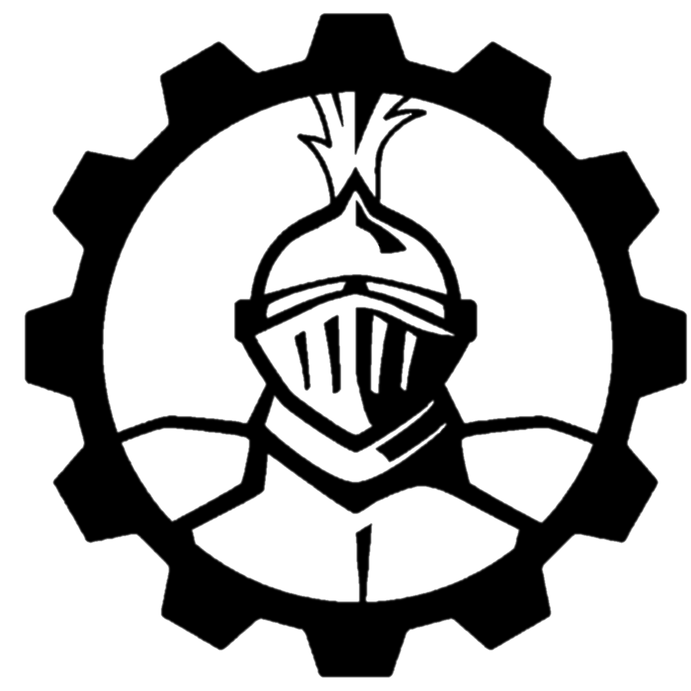

	
	<h1>Website</h1>
	

		<b>🌍 New Website for the Team 501 The PowerKnights</b>
	

    
     
    
    

# [🚧 Website 🚧](https://team-501-the-powerknights.github.io/Website/)

Website for the team that is currently in development. Due to replace our old WordPress site sometime in 2020. Viewable at [https://team-501-the-powerknights.github.io/Website/](https://team-501-the-powerknights.github.io/Website/)

# License

This project is licensed under the MIT license.
© 2020 Team 501 - The PowerKnights. Please see `LICENSE.md` for full license details.
